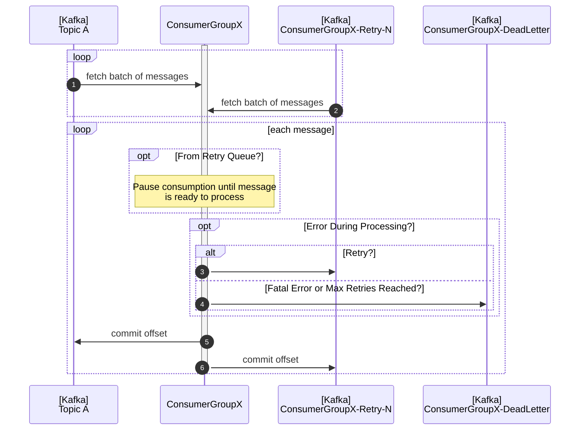
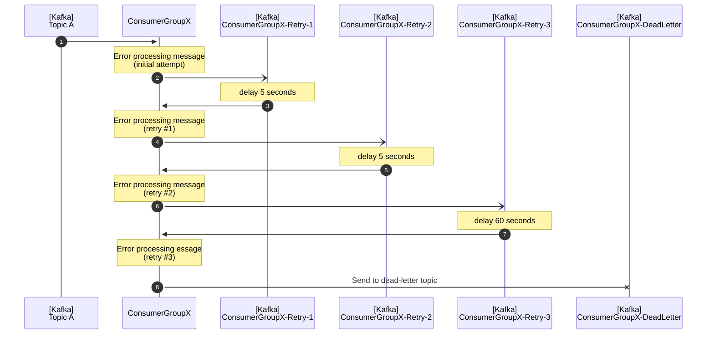
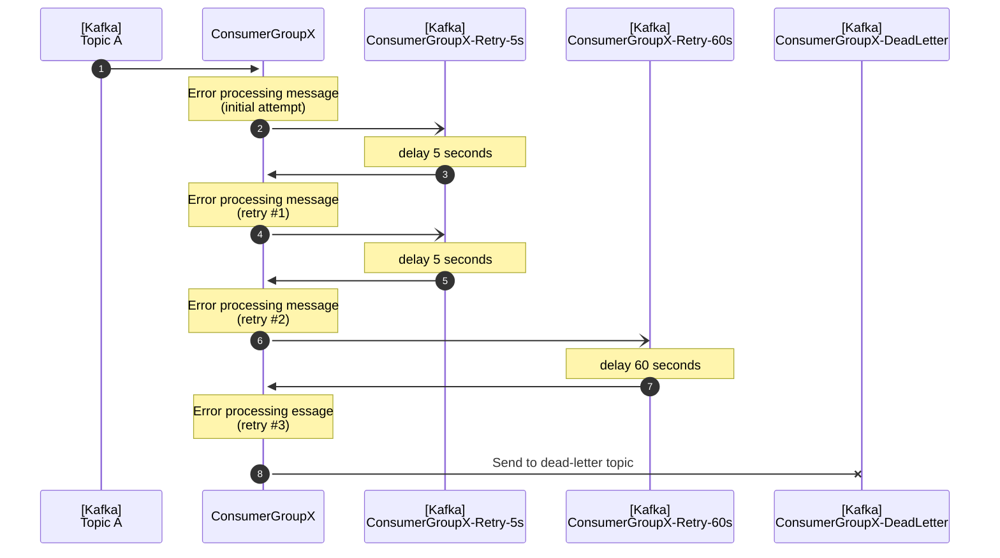

# kafka-uroboros

[](https://www.npmjs.com/package/kafka-uroboros)
[](https://www.npmjs.com/package/kafka-uroboros)
[](https://www.npmjs.com/package/kafka-uroboros)
[](https://github.com/SkeLLLa/kafka-uroboros/actions)
[](https://gitlab.com/m03geek/kafka-uroboros/blob/master/LICENSE)

This library extends capabilities of [KafkaJS](https://kafka.js.org/) client.

## Features

- AsyncRetryConsumer class that provides async non-blocking retries capabilities. Based on [kafkajs-async-retry](https://www.npmjs.com/package/kafkajs-async-retry) library with some refactoring and adding more customization. There are not a lot of changes in the interface, so it will be easy to migrate if necessary.
- Typed consumer events exposed via EventEmitter's `on` and regular `onMessage` interface.
- [TODO] Topic wrapper class with easy produce/consume and pub/sub configuration.

## Getting Started

### Prerequisites

Your project should have a dependency on [KafkaJS](https://kafka.js.org/), which is listed as a peer dependency of this module.
This module has no other runtime dependencies.

### Installation

```bash
pnpm install kafkajs-uroboros
# or using yarn
yarn add kafkajs-uroboros
```

### Compatibility Requirements

1. You must be using a version of Kafka that supports message headers (`>= v0.11.0.0`).
2. You must be using a version of KafkaJS that provides a `pause` callback function to the `eachMessage`/`eachBatch` handler functions (`>= 2.1.0`)
3. Recommended version of KafkaJS client is `2.2.2`, since versions `>=2.2.3 <=2.2.4` have CPU usage bug.

### Kafka Setup

Depending on how you want to retry failed messages, you must create topics to store the retried messages in addition to the primary topics that your application is already using.

#### Topic name strategy

Retry topics could have different naming strategies and this behaviour could be customized by supplying [`AsyncRetryConsumer`](docs/api/kafka-uroboros.asyncretryconsumer._constructor_.md) with a method for generating topic names in [`topicNameStrategy`](docs/api/kafka-uroboros.iasyncretryconsumeroptions.topicnamestrategy.md) property.

Remember, each of the topics used for facilitating retries should also have appropriate retention configurations that don't conflict with your retry times.
For example, if your retry policy requires messages to be persisted for 24 hours before a retry is attempted, your retention policy should allow plenty of leeway for the retry message to be picked up.

Below you can find built-in strategies that are available out of the box.

##### By retry (default)

See [docs](docs/api/kafka-uroboros.topicnamestrategy.byretry.md).

If `topic` and `groupId` both supplied in [`AsyncRetryConsumer` constructor](docs/api/kafka-uroboros.asyncretryconsumer._constructor_.md) it will construct retry topics with the following pattern: `${groupId}-${topic}-retry-1`, `${groupId}-${topic}-retry-2`, ... , `${groupId}-${topic}-retry-N`.
Dead letter topic will have following format: `${groupId}-${topic}-dlq`

If `groupId` will be omitted, then it will create retry topics without it and they will be the following `${topic}-retry-1`, `${topic}-retry-2`, ... , `${topic}-retry-N`.
Dead letter topic will have following format: `${topic}-dlq`.
**Note** with this pattern other consumer groups that are subscribed to the topic may consume retry topics as well.

##### By delay

See [docs](docs/api/kafka-uroboros.topicnamestrategy.bydelay.md).

If `topic` and `groupId` both supplied in [`AsyncRetryConsumer` constructor](docs/api/kafka-uroboros.asyncretryconsumer._constructor_.md) it will construct retry topics with the following pattern based on provided retry delays: `${groupId}-${topic}-delay-10`, `${groupId}-${topic}-delay-30`, ... , `${groupId}-${topic}-delay-N`.
Dead letter topic will have following format: `${groupId}-${topic}-dlq`

If `groupId` will be omitted, then it will create retry topics without it and they will be the following `${topic}-delay-10`, `${topic}-delay-30`, ... , `${topic}-delay-N`.
Dead letter topic will have following format: `${topic}-dlq`.
**Note** with this pattern other consumer groups that are subscribed to the topic may consume retry topics as well.

##### By retry (group shared)

Same as [By Retry](#by-retry-default), but uses shared retry topics for all topics consumer group is subscribed to. In this case supplying `groupId` in [`AsyncRetryConsumer` constructor](docs/api/kafka-uroboros.asyncretryconsumer._constructor_.md) is mandatory.

It will create retry topics like the following `${groupId}-retry-1`, `${groupId}-retry-2`, ... , `${groupId}-retry-N`.
Dead letter topic will have following format: `${groupId}-dlq`.

See [docs](docs/api/kafka-uroboros.topicnamestrategy.byretrygroup.md).

##### By delay (group shared)

See [docs](docs/api/kafka-uroboros.topicnamestrategy.bydelaygroup.md).

Same as [By Delay](#by-delay), but uses shared retry topics for all topics consumer group is subscribed to. In this case supplying `groupId` in [`AsyncRetryConsumer` constructor](docs/api/kafka-uroboros.asyncretryconsumer._constructor_.md) is mandatory.

It will create retry topics like the following `${groupId}-delay-10`, `${groupId}-delay-30`, ... , `${groupId}-delay-N`.
Dead letter topic will have following format: `${groupId}-dlq`.

### Example Usage

To use this module, create an `AsyncRetryConsumer` object with the parameters that specify the retry delay, retry strategy, and number of retries, as in this example:

```ts
import { AsyncRetryConsumer } from 'kafka-uroboros';

const asyncRetryConsumer = new AsyncRetryConsumer({
  producer,
  topic: 'my-topic-name',
  retryDelays: [5, 30, 60],
  maxRetries: 3,
});
```

Then you'll need to ensure that your consumer is subscribed to the appropriate retry topics.

```ts
consumer.subscribe({
  topics: [
    ...asyncRetryConsumer.topics.retries, // retry topics
    ...asyncRetryConsumer.topics.dlq, // dlq topic
    ...asyncRetryConsumer.topics.original, // original topic
  ],
  fromBeginning: true,
});
```

Finally, use the [`eachMessage()`](docs/api/kafka-uroboros.asyncretryconsumer.eachmessage.md) or [`eachBatch()`](docs/api/kafka-uroboros.asyncretryconsumer.eachbatch.md) helpers to process the messages.
To indicate that the message failed to process and send it back to the retry topics, throw an exception.

```ts
await consumer.run({
  eachMessage: asyncRetryConsumer.eachMessage(
    async ({ topic, originalTopic, message, previousAttempts }) => {
      if (previousAttempts > 0) {
        console.log(`Retrying message from topic ${originalTopic}`);
      }
      // do something with the message (exceptions will be caught and the
      // message will be sent to the appropriate retry or dead-letter topic)
      processMessage(message);
    },
  ),
});
```

Here's a complete example:

```ts
import { AsyncRetryConsumer, EAsyncRetryConsumerEvents } from 'kafka-uroboros';
import { Kafka } from 'kafkajs';

const kafka = new Kafka({
  clientId: 'my-app',
  brokers: ['kafka1:9092', 'kafka2:9092'],
});

const producer = kafka.producer();
const consumer = kafka.consumer({ groupId: 'test-group' });

const asyncRetryConsumer = new AsyncRetryConsumer({
  producer,
  topic: 'my-topic-name',
  retryDelays: [5, 30, 60],
  maxRetries: 3,
});

// set up the consumer
await consumer.connect();
await consumer.subscribe({
  topics: [
    ...asyncRetryConsumer.topics.retries, // retry topics
    ...asyncRetryConsumer.topics.dlq, // dlq topic
    ...asyncRetryConsumer.topics.original, // original topic
  ],
  fromBeginning: true,
});

// consume messages one at a time
await consumer.run({
  eachMessage: asyncRetryConsumer.eachMessage(
    async ({ topic, originalTopic, message, previousAttempts }) => {
      if (previousAttempts > 0) {
        console.log(`Retrying message from topic ${originalTopic}`);
      }
      // do something with the message (exceptions will be caught and the
      // message will be sent to the appropriate retry or dead-letter topic)
      processMessage(message);
    },
  ),
});

// or, consume messages as a batch (more advanced, requires more
// implementation on your part)
await consumer.run({
  eachBatch: asyncRetryConsumer.eachBatch(
    async ({ messageFailureHandler, asyncRetryMessageDetails, ...payload }) => {
      payload.batch.messages.forEach((message) => {
        if (asyncRetryMessageDetails.previousAttempts > 0) {
          console.log(
            `Retrying message from topic ${asyncRetryMessageDetails.originalTopic}`,
          );
        }
        try {
          // do something with message
        } catch (err) {
          messageFailureHandler(err, message);
        }
      });
    },
  ),
});

// you can register event handlers for a couple relevant events if
// you'd like to take any action when messages are being queued for retry
// or dead-lettering. These events are fired _after_ the message has been sent
// to the relevant topic.
asyncRetryConsumer.on(EAsyncRetryConsumerEvents.RETRY, ({ message, error }) => {
  // log info about message/error here
});
asyncRetryConsumer.on(
  EAsyncRetryConsumerEvents.DEAD_LETTER,
  ({ message, error }) => {
    // log info about message/error here
  },
);
```

## Overview and Methodology

The approach used here has been explained in detail in various places including a helpful [blog post from Uber Engineering](https://eng.uber.com/reliable-reprocessing/).
To summarize: when a message cannot be processed successfully, it is published to a different "retry" topic.
The current offset on the original topic/partition is advanced as if the message was successfully processed so other messages can be processed without delay.
Messages from the "retry" topics are then processed after a configurable delay.
If a message continues to fail beyond a configurable maximum number of attempts, the message is published to a "dead letter" topic for manual inspection.
Here's a sequence diagram demonstrating the process:



### Retry strategies

#### Topics based on the number of attempts

By default, the `kafka-uroboros` module will publish a failed message to a retry topic based on the number of previous attempts.

For example, if you want your consumer group to retry messages three times, you need three topics (in addition to the primary topics and the dead-letter topic mentioned above): `${topicName}-retry-1`, `${topicName}-retry-2`, and `${topicName}-retry-3`.

This retry strategy has these advantages:

- You can set the retry delay dynamically in the code without having to create any new topics.
  However, if you change the retry delay, existing messages in the retry topic keep the delay time that was in effect when they were published to the retry topic.
- Based on the number of messages in each topic, you can see how many retries are required before messages are processed successfully.
  If you are monitoring for offset lag on these retry topics, you must take the configured delay into account since each message being retried waits for a certain amount of time before the retry consumer picks it up.

A downside of this strategy is that if you want to increase the number of retries, you must create additional topics.

Here's a diagram of the message flow using this retry strategy.
This example uses a maximum of three retries with configured wait times of 5 seconds on the first two retries and a 60-second delay on the final attempt:



#### Topics based on the configured delay

Another naming strategy is to name retry topics based on the number of seconds to delay between attempts.
This module puts the messages into different topics depending on how long to wait before retrying them.

For example, if you want to retry messages every 5 seconds, you can create a topic named `${topicName}-retry-5s` and send messages to that topic repeatedly until they succeed or reach the maximum number of attempts.
If you have various delays based on which attempt is, you need a topic for each distinct configured delay.
Note the `s` at the end of the topic name, which indicates that it is the number of seconds to wait and not the number of retries as used in the prior naming strategy.

The advantage of this strategy is that you can retry messages many times without having to create many topics, as long as the length of the delay stays the same.
If you want to always wait the same amount of time between each attempt, you need only one retry topic and the dead letter topic.

However, if you want to change the length of the delays, you must create additional topics and ensure that any remaining messages from the existing topics are processed.
This strategy also prevents you from easily judging how many messages are reaching different levels of retry, because you can't tell how many times a message has been tried based on which topic it's in.

Here's a sequence diagram of the various topics needing when using a delay based naming strategy with the `retryDelaysSeconds` parameter set to `[5, 5, 60]`:



## API

See [api docs](docs/api/index.md)
